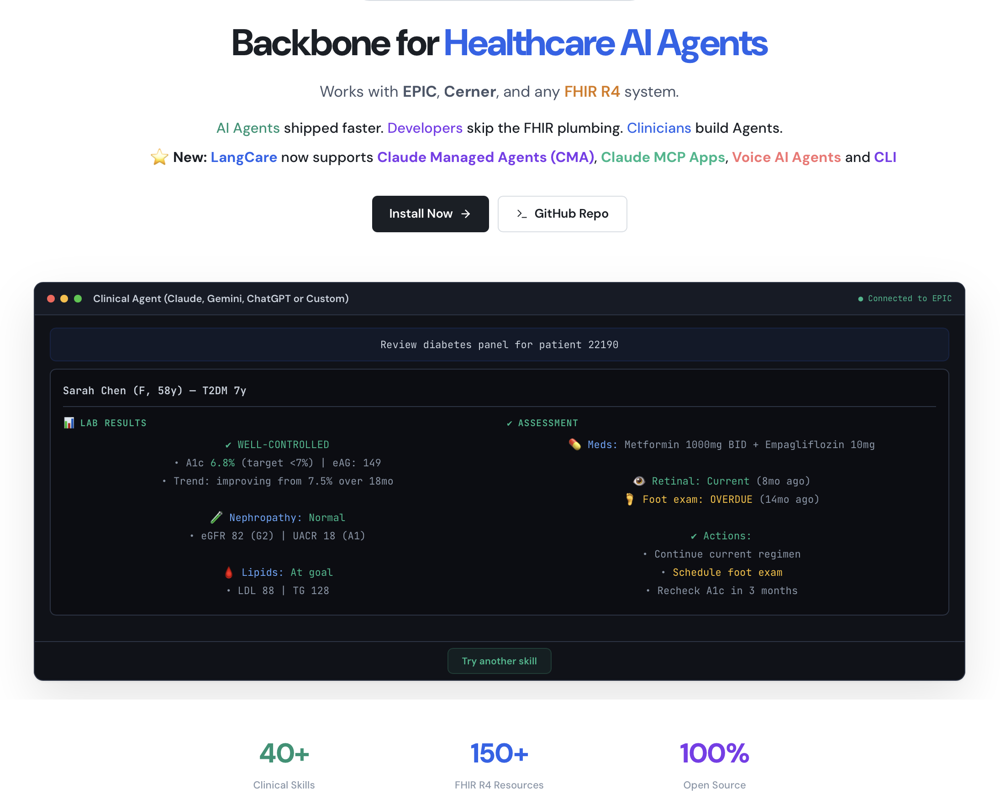
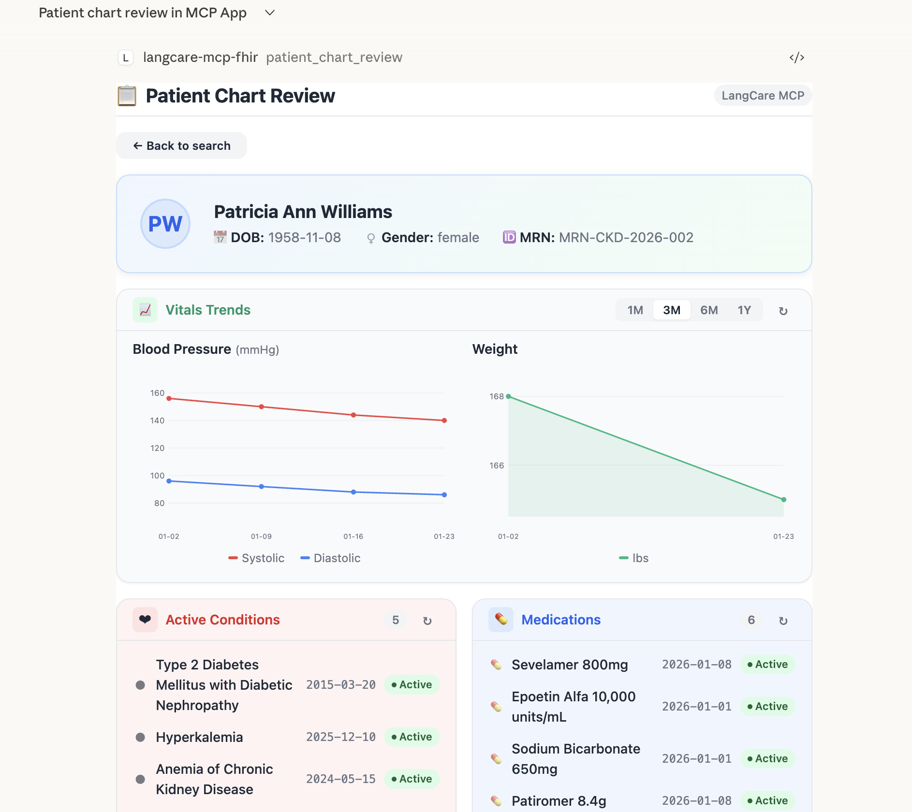
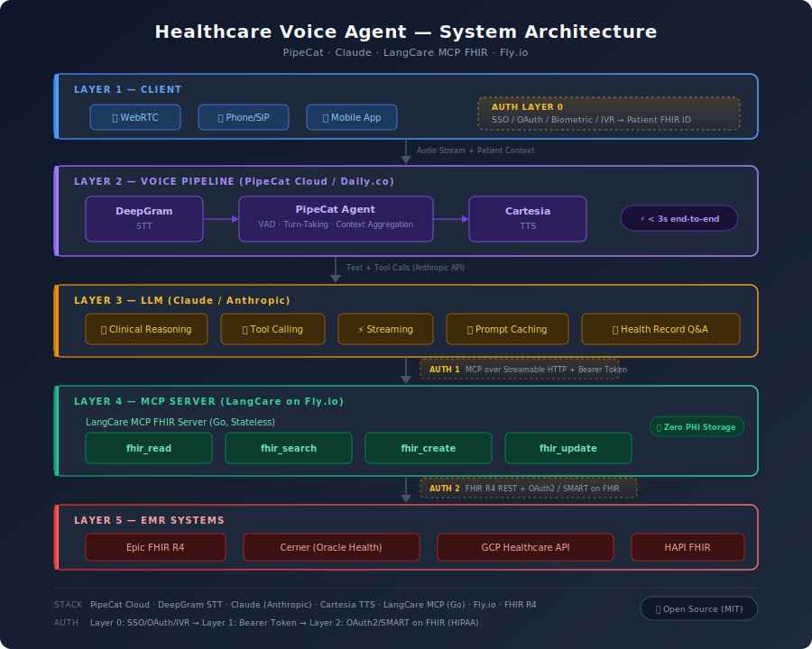

# LangCare MCP FHIR Server

[](https://github.com/langcare/langcare-mcp-fhir)
[](https://github.com/langcare/langcare-mcp-fhir/graphs/contributors)
[](https://github.com/langcare/langcare-mcp-fhir/blob/main/LICENSE)
[](https://github.com/langcare/langcare-mcp-fhir/blob/main/go.mod)

Enterprise-grade MCP Server for FHIR-based EMRs. Fully written in Go with enterprise-grade security and 4 generic FHIR operations that work with any FHIR R4 resource type. Supports **EPIC**, **Cerner**, **OpenEMR**, **GCP Healthcare API**, and any generic FHIR R4 server.

Ships with a **[40+ Clinical Skills Library](skills/README.md)** — agent-agnostic workflow guides covering medication management, lab interpretation, clinical decision support, documentation, population health, and more. Extend with ✨ **New: [Claude Managed Agents](#claude-managed-agents)** (9 production-ready clinical AI agents on the Anthropic Managed Agents API), **[MCP Apps](apps/README.md)** (interactive clinical UIs inside Claude Desktop), a **[Healthcare Voice Agent](pipecat-agent/README.md)** (real-time voice AI over FHIR), and a **[LangCare CLI](cli/README.md)** for agent frameworks that don't speak MCP natively.

<p align="center">
  <a href="https://langcare.ai">
    
  </a>
  <br />
  <a href="https://langcare.ai">langcare.ai</a>
</p>

## Installation

Install via npm:

```bash
npm install -g @langcare/langcare-mcp-fhir
```

Or use directly without installation:

```bash
npx @langcare/langcare-mcp-fhir -config /path/to/config.yaml
```

## Quick Configuration

LangCare MCP FHIR connects Claude to your FHIR-based EMR system. You need a YAML configuration file pointing to your backend.

### 1. Get a Config Template

Choose your backend:

- **EPIC:** [config.epic.example.yaml](https://github.com/langcare/langcare-mcp-fhir/blob/main/configs/config.epic.example.yaml)
- **Cerner:** [config.cerner.example.yaml](https://github.com/langcare/langcare-mcp-fhir/blob/main/configs/config.cerner.example.yaml)
- **OpenEMR:** [config.openemr.example.yaml](https://github.com/langcare/langcare-mcp-fhir/blob/main/configs/config.openemr.example.yaml)
- **GCP Healthcare API:** [config.gcp.example.yaml](https://github.com/langcare/langcare-mcp-fhir/blob/main/configs/config.gcp.example.yaml)
- **Any FHIR R4 Server:** [config.base.example.yaml](https://github.com/langcare/langcare-mcp-fhir/blob/main/configs/config.base.example.yaml)

### 2. Configure Claude Desktop

Add to your Claude Desktop config file (`~/.config/Claude/claude_desktop_config.json`):

```json
{
  "mcpServers": {
    "langcare-mcp-fhir": {
      "command": "langcare-mcp-fhir",
      "args": ["-config", "/path/to/your/config.yaml"]
    }
  }
}
```

On macOS, the config is typically at:
```
~/Library/Application\ Support/Claude/claude_desktop_config.json
```

### 3. Restart Claude Desktop

Close and reopen Claude Desktop. The FHIR tools will now be available.

**Need detailed setup help?** See the [Local Testing Guide](https://github.com/langcare/langcare-mcp-fhir/blob/main/docs/LOCAL-TESTING.md).

## Architecture

This MCP server acts as an intelligent proxy between AI agents and FHIR R4 servers. It exposes 4 generic FHIR operations through the Model Context Protocol (MCP), enabling AI-powered workflows for any FHIR resource type.

**Key Design:**
- **MCP SDK:** Official `github.com/modelcontextprotocol/go-sdk` (Anthropic/Google maintained)
- **FHIR Client:** Generic HTTP client working with any FHIR R4 server
- **Transport:** stdio and Streamable HTTP
- **Backend:** Proxy to existing FHIR server (no database)
- **Language:** 100% Go for high performance and reliability

## 4 Generic MCP Tools

All tools work with **any FHIR resource type** (Patient, Observation, Medication, etc.):

### 1. fhir_read
Read a FHIR resource by type and ID.

```json
{
  "resourceType": "Patient",
  "id": "example-123"
}
```

### 2. fhir_search
Search FHIR resources with query parameters.

```json
{
  "resourceType": "Patient",
  "queryParams": "name=John&birthdate=gt1990-01-01"
}
```

### 3. fhir_create
Create a new FHIR resource.

```json
{
  "resourceType": "Observation",
  "resource": {
    "resourceType": "Observation",
    "status": "final",
    "code": { ... },
    "subject": { "reference": "Patient/123" }
  }
}
```

### 4. fhir_update
Update an existing FHIR resource.

```json
{
  "resourceType": "Patient",
  "id": "example-123",
  "resource": {
    "resourceType": "Patient",
    "id": "example-123",
    "name": [{ "family": "Smith" }]
  }
}
```

## Security Architecture

LangCare MCP FHIR implements a **two-layer security model** for HIPAA-compliant healthcare data access:

```
┌─────────────┐         ┌──────────────┐         ┌─────────────┐
│   Claude    │ Auth1   │  MCP Server  │ Auth2   │  FHIR API   │
│   Client    │────────▶│   (Go)       │────────▶│   (EMR)     │
└─────────────┘         └──────────────┘         └─────────────┘

Auth1: MCP Client Authentication (Bearer Token/API Key)
Auth2: FHIR Backend Authentication (Bearer/OAuth2/SMART on FHIR)
```

### Security Features

- ✅ **TLS 1.3** encryption for HTTP transport
- ✅ **PHI Scrubbing** in logs (enabled by default)
- ✅ **HIPAA-compliant** audit logging
- ✅ **No persistent PHI storage** (stateless proxy)
- ✅ **Secrets via environment variables** (never in config files)
- ✅ **OAuth 2.0** with automatic token refresh
- ✅ **mTLS** support for service-to-service communication
- ✅ **Rate limiting** per client

### Supported Authentication Methods

- **Bearer Token** - Simple API key authentication
- **OAuth2** - Full OAuth2 flow with token refresh
- **SMART on FHIR Backend Services** - `private_key_jwt` (RS384) for EPIC, OpenEMR, and other SMART-conformant EMRs
- **SMART on FHIR** - EPIC, Cerner, OpenEMR, and other EMR standards
- **Basic Auth** - Username/password authentication
- **Custom** - Extensible for additional auth methods

**For complete security documentation, see [Security Guide](https://github.com/langcare/langcare-mcp-fhir/blob/main/docs/SECURITY.md):**
- HIPAA compliance checklist
- OAuth configuration for EPIC/Cerner/GCP
- Kubernetes security manifests
- Credential management procedures
- Audit logging implementation

## MCP Apps (Interactive UIs)

LangCare MCP FHIR ships with built-in **MCP Apps** — interactive, rich UI views that run directly inside MCP-capable hosts like Claude Desktop. Unlike traditional chat-based tool output, MCP Apps render full React-based interfaces with charts, tables, and interactive controls while using the same underlying FHIR tools.

**How it works:** Each app is a single-file HTML bundle (React + TypeScript, compiled with Vite) that gets embedded into the Go binary at compile time via `go:embed`. At runtime the MCP server registers each app as both an MCP Resource (`text/html;profile=mcp-app`) and a dedicated MCP Tool linked via `_meta.ui.resourceUri`. When an MCP host calls the tool, it fetches the resource and renders the UI. The app calls back into the server's generic FHIR tools (`fhir_search`, `fhir_read`, etc.) through `app.callServerTool()` — no LLM round-trips for data fetching.

**Advantages over plain tool output:**
- **Rich visualization** — SVG charts, color-coded cards, expandable detail panels
- **Interactive controls** — search fields, date range pickers, click-to-expand rows
- **Deterministic data fetching** — apps call FHIR tools directly, no LLM involvement in data retrieval
- **Zero external dependencies** — everything inlines into a single HTML file, embedded in the binary
- **Works offline** — no CDN, no external scripts, no network requests beyond FHIR API calls

### Built-in Apps

| App | Tool | Description |
|-----|------|-------------|
| **FHIR Explorer** | `fhir_explorer` | Interactive FHIR resource browser. Search, read, create, and update any FHIR R4 resource type with JSON detail views. |
| **Patient Chart Review** | `patient_chart_review` | Clinical dashboard with patient demographics, active conditions, medications, vitals, labs, and vitals trend charts (BP + weight over time). |

Both apps are reference implementations demonstrating the MCP Apps pattern. See **[apps/README.md](apps/README.md)** for architecture details and how to build new apps.

<p align="center">
  
  <br />
  <em>Patient Chart Review running inside Claude Desktop</em>
</p>

## Agent Usage

AI agents use LangCare MCP FHIR Server to help healthcare professionals access and manage patient health records through 4 FHIR tools. The server handles EMR authentication, allowing agents to focus on clinical workflows while maintaining strict privacy and accuracy standards.

**Agent capabilities:**
- **Search, Read, Create, Update** - Any FHIR R4 resource (Patient, Observation, Medication, etc.)
- **Patient privacy** - Use partial identifiers, confirm identity before updates
- **Clinical accuracy** - Verify data, use standard codes (LOINC, SNOMED, RxNorm)
- **Professional communication** - Structure responses with context, findings, and next steps

**Common workflows:**
- **Patient lookup:** Search by name/DOB → verify identity → read full details
- **Clinical review:** Retrieve labs, vitals, medications → present with reference ranges
- **Documentation:** Extract structured data → map to FHIR resources → confirm → create
- **Updates:** Verify existing resource → modify → confirm changes → update

**System support:**
- Works with any FHIR R4 resource type (60+ types including DocumentReference, Binary, Media)
- Automatic authentication and token refresh to EPIC, Cerner, OpenEMR, GCP Healthcare API
- HIPAA-compliant PHI handling with audit logging
- Comprehensive OAuth2 scopes for clinical data access

**📖 Complete guide:** [Agent Prompt Guide](https://github.com/langcare/langcare-mcp-fhir/blob/main/docs/AGENT_PROMPT.md) - System prompt, tool examples, workflows, and error handling

## Clinical Skills Library (Optional)

**40+ agent-agnostic clinical workflow guides** that teach AI agents how to perform complex healthcare tasks using the MCP server's 4 FHIR tools (`fhir_search`, `fhir_read`, `fhir_create`, `fhir_update`).

- **Optional** - The MCP server works without them
- **Portable** - Work with Claude, ChatGPT, Gemini, or any AI agent
- **Evidence-based** - Built on USPSTF, ADA, ACC/AHA, CDC, ACOG, KDIGO, and other society guidelines
- **Copy-paste ready** - Add a skill's `SKILL.md` to your agent's system prompt or custom instructions

### Skill Categories (40 Skills)

| Category | Skills | Examples |
|----------|--------|----------|
| **Patient Data & Summary** | 5 | Demographics, clinical summary (CCD-style), problem list audit, allergy review, insurance coverage |
| **Medication Management** | 5 | Med reconciliation, drug interactions (CYP450), adherence (MPR/PDC), Beers Criteria, opioid risk (ORT/MME) |
| **Lab & Diagnostics** | 5 | Lab interpretation, critical values (CAP/CLIA), pre-op labs, diabetes panel (ADA), renal function (KDIGO) |
| **Clinical Decision Support** | 5 | Sepsis (qSOFA/SOFA), cardiovascular risk (ASCVD/HEART), VTE (Wells/Caprini), fall risk (Morse), pneumonia (CURB-65) |
| **Care Coordination** | 5 | Discharge planning (LACE), referrals, care gaps (USPSTF), transitions of care (I-PASS), follow-up tasks |
| **Documentation** | 5 | SOAP notes, H&P, progress notes, discharge summaries, procedure notes |
| **Population Health** | 5 | Panel overview, quality measures (HEDIS), chronic disease registries, immunization status (CDC), preventive care compliance |
| **Specialty** | 5 | Prenatal (ACOG), pediatric growth (WHO/CDC), mental health (PHQ-9/GAD-7), oncology (TNM/RECIST), chronic pain |

**Full catalog with links:** [skills/README.md](skills/README.md)

### How to Use Skills

1. **Browse** the [skills/core/](skills/core/) directory and pick a skill
2. **Copy** the skill's `SKILL.md` content into your AI agent's system prompt or custom instructions
3. **Reference files** in each skill's `references/` subdirectory contain detailed clinical knowledge (scoring criteria, code tables, thresholds) that can optionally be included for deeper clinical accuracy

```
# Example: Add medication-reconciliation skill to your agent
skills/core/medication-management/medication-reconciliation/
├── SKILL.md              # Copy this into agent instructions
└── references/
    ├── reconciliation-process.md   # Joint Commission standards
    └── high-risk-medications.md    # ISMP high-alert drug list
```

**Integration guides:** [Claude](integrations/claude/) | [ChatGPT](integrations/chatgpt/) | [Gemini](integrations/gemini/)

**Community contributions welcome** - see [CONTRIBUTING.md](CONTRIBUTING.md) for guidelines.

## Development & Testing

### Build from Source

```bash
make build
```

### Run Locally (stdio mode)

```bash
make run
# or
./bin/langcare-mcp-fhir -config configs/config.local.yaml
```

### Run in HTTP Mode (Streamable HTTP)

```bash
make run-http
# or
./bin/langcare-mcp-fhir -http -port 8080 -config configs/config.yaml
```

Starts the server with Streamable HTTP transport on `/mcp` and health check on `/health`.

### Run Tests

```bash
make test
```

### Lint Code

```bash
make lint
```

### Deploy to Fly.io (Remote Streamable HTTP)

Deploy as a remote MCP server with Streamable HTTP transport, accessible by any MCP-compatible AI agent from anywhere.

```bash
# Install Fly CLI
brew install flyctl
fly auth login

# Create app
fly apps create --name langcare-mcp-dev

# Set CONFIG_FILE in fly/fly.dev.toml [env] block for your provider (EPIC or GCP)
# Then set secrets (EPIC example):
fly secrets set \
  EPIC_BASE_URL="https://fhir.epic.com/interconnect-fhir-oauth/api/FHIR/R4" \
  EPIC_CLIENT_ID="your-client-id" \
  EPIC_TOKEN_URL="https://fhir.epic.com/interconnect-fhir-oauth/oauth2/token" \
  EPIC_PRIVATE_KEY_B64="$(base64 < keys/epic/private-key.pem)" \
  MCP_AUTH_TOKENS="your-token" \
  --app langcare-mcp-dev

# Deploy
fly deploy -c fly/fly.dev.toml --app langcare-mcp-dev

# Verify
curl https://langcare-mcp-dev.fly.dev/health
```

Connect any MCP client to:

```
URL:   https://langcare-mcp-dev.fly.dev/mcp
Auth:  Authorization: Bearer your-token
```

Claude Desktop (`claude_desktop_config.json`):

```json
{
  "mcpServers": {
    "langcare-fhir": {
      "url": "https://langcare-mcp-dev.fly.dev/mcp",
      "headers": {
        "Authorization": "Bearer your-token"
      }
    }
  }
}
```

Supports EPIC and GCP Healthcare API providers. See **[fly/README.md](fly/README.md)** for provider setup, secrets, and full deployment guide.

### Local Testing with EPIC

For step-by-step instructions on setting up EPIC credentials and testing locally:

**[📖 Local Testing Guide](https://github.com/langcare/langcare-mcp-fhir/blob/main/docs/LOCAL-TESTING.md)**

This guide covers:
- Generating RSA keys and JWKS
- Configuring EPIC credentials
- Running the server locally
- Testing with Claude Desktop
- Troubleshooting common issues

**Quick credential test:**
```bash
# Test your EPIC credentials before running the server
go run test/test_epic_token.go "your-client-id" "/path/to/private-key.pem"
```

## Project Structure

```
langcare-mcp-fhir/
├── cmd/
│   └── server/
│       └── main.go                          # Entry point
├── internal/
│   ├── apps/                                # MCP Apps (embedded UIs)
│   │   ├── embed.go                         # go:embed directive for HTML bundles
│   │   ├── registry.go                      # App metadata, tool names, resource URIs
│   │   └── dist/                            # Built HTML bundles (copied by build)
│   │       ├── fhir-explorer.html           # FHIR Explorer single-file bundle
│   │       └── patient-chart-review.html    # Patient Chart Review single-file bundle
│   ├── audit/
│   │   └── logger.go                        # HIPAA audit logging
│   ├── config/
│   │   └── config.go                        # YAML configuration loading
│   ├── fhir/
│   │   ├── client.go                        # FHIR HTTP client interface
│   │   ├── types.go                         # FHIR client types
│   │   └── providers/                       # Backend implementations
│   │       ├── base.go                      # Base HTTP provider
│   │       ├── epic.go                      # EPIC OAuth2 provider
│   │       ├── cerner.go                    # Cerner OAuth2 provider
│   │       ├── openemr.go                   # OpenEMR SMART Backend Services provider
│   │       └── gcp.go                       # GCP Healthcare API provider
│   ├── mcp/
│   │   └── server.go                        # MCP server + app registration
│   ├── middleware/
│   │   ├── auth.go                          # MCP authentication
│   │   └── rate_limit.go                    # Rate limiting
│   ├── tools/                               # MCP tool implementations
│   │   ├── registry.go                      # Tool registry
│   │   ├── fhir_read.go                     # Read FHIR resource
│   │   ├── fhir_search.go                   # Search FHIR resources
│   │   ├── fhir_create.go                   # Create FHIR resource
│   │   └── fhir_update.go                   # Update FHIR resource
│   └── transport/
│       ├── stdio.go                         # stdio transport (Claude Desktop)
│       └── http.go                          # Streamable HTTP transport (production)
├── apps/                                    # MCP App source code (React + TypeScript)
│   ├── README.md                            # App development guide
│   ├── package.json                         # Shared dependencies (React 19, MCP Apps SDK)
│   ├── vite.config.ts                       # Vite build config (single-file output)
│   ├── tsconfig.json                        # TypeScript config
│   ├── fhir-explorer/                       # FHIR Explorer app
│   │   ├── index.html
│   │   └── src/
│   │       ├── app.tsx
│   │       └── global.css
│   └── patient-chart-review/                # Patient Chart Review app
│       ├── index.html
│       └── src/
│           ├── app.tsx
│           └── global.css
├── scripts/
│   ├── build-apps.sh                        # Build all apps → internal/apps/dist/
│   ├── create_jwks.sh                       # Generate JWKS from public key (EPIC)
│   └── create_jwks_openemr.sh               # Generate JWKS from public key (OpenEMR)
├── pkg/
│   └── types/
│       └── errors.go                        # Custom error types
├── configs/
│   ├── config.epic.example.yaml             # Example configuration for EPIC
│   ├── config.cerner.example.yaml           # Example configuration for Cerner
│   ├── config.openemr.example.yaml          # Example configuration for OpenEMR
│   ├── config.gcp.example.yaml              # Example configuration for GCP
│   └── config.base.example.yaml             # Example configuration for any FHIR R4 server
├── docs/
│   ├── AGENT_PROMPT.md                      # AI agent system prompt
│   ├── EPIC-APP-SECURITY.md                 # EPIC authentication setup
│   ├── OPENEMR-APP-SECURITY.md              # OpenEMR SMART Backend Services setup
│   ├── EPIC-SCOPES.md                       # OAuth2 scopes reference
│   ├── LOCAL-TESTING.md                     # Local development guide
│   └── SECURITY.md                          # Production security guide
├── test/
│   ├── README.md                            # Test documentation
│   └── test_epic_token.go                   # EPIC OAuth2 token tester
├── fly/
│   ├── Dockerfile                           # Multi-stage Go build for Fly.io
│   ├── docker-entrypoint.sh                 # Key materialization + server startup
│   ├── fly.dev.toml                         # Fly.io dev deployment config
│   ├── config.fly.epic.yaml                 # Fly.io EPIC provider config
│   ├── config.fly.gcp.yaml                  # Fly.io GCP provider config
│   └── README.md                            # Fly.io deployment guide
├── bin/                                     # Build output (gitignored)
│   └── langcare-mcp-fhir                    # Compiled binary
├── go.mod                                   # Go module definition
├── go.sum                                   # Go module checksums
├── Makefile                                 # Build commands
└── README.md                                # This file
```

**Note:** The following are gitignored and not committed:
- `keys/` - Private keys and credentials
- `config.local.*.yaml` - Local configuration files
- `bin/` - Compiled binaries
- `.env` - Environment variables
- `apps/node_modules/`, `apps/dist/`, `apps/dist-tmp/` - App build artifacts

## Healthcare Voice Agent

Real-time voice AI that lets patients ask about their health records and get spoken answers pulled directly from their EMR.

<p align="center">
  
</p>

**The stack:** [PipeCat](https://docs.pipecat.ai/) (open-source, Daily.co) for the voice pipeline — STT, LLM orchestration, TTS with sub-3-second latency. Claude for clinical reasoning and tool calling. LangCare MCP FHIR Server (open-source, Go) as a stateless proxy to any FHIR R4 EMR — Epic, Cerner, GCP Healthcare API.

**MCP is the glue.** PipeCat's native MCP client auto-discovers FHIR tools at startup. Patient asks "What medications am I on?" — Claude calls `fhir_search` — PipeCat routes it to the MCP server — data comes back — Claude responds in natural speech. No manual tool schemas needed.

**Three-layer HIPAA auth:** Caller identity verified before the session starts, bearer token to MCP, OAuth2/SMART on FHIR to EMR. Zero PHI storage.

**Everything is swappable.** Replace Claude with Gemini, DeepGram with Google STT, Daily with WebSocket. The MCP FHIR layer and clinical prompts stay the same.

**[Full documentation and setup guide](pipecat-agent/README.md)**

## LangCare CLI

Command-line interface that wraps the 4 FHIR MCP tools (`fhir_search`, `fhir_read`, `fhir_create`, `fhir_update`) as CLI subcommands over HTTP. Built for AI agent frameworks that don't speak MCP natively — LangChain, smolagents, CrewAI, AutoGen, and any framework that can call a subprocess. The CLI handles the MCP session handshake internally, so agents get clean JSON on stdout with no protocol knowledge required.

<p align="center">
  
</p>

```bash
# Install
pip install "langcare-cli @ git+https://github.com/langcare/langcare-mcp-fhir.git#subdirectory=cli"

# Use
langcare fhir search Patient --query "name=John"
langcare fhir read Patient 123
langcare fhir create Observation --data @obs.json
langcare fhir update Patient 123 --data @patient.json
```

The 40+ clinical skills in the [Skills Library](skills/README.md) work as-is — skills reference abstract tool names, not transport. Register the CLI as subprocess tools in your agent framework and skills run without modification.

**[Full documentation and setup guide](cli/README.md)**

## Documentation

### Getting Started
- **[📖 Local Development & Testing Guide](https://github.com/langcare/langcare-mcp-fhir/blob/main/docs/LOCAL-TESTING.md)** - Complete guide for local setup and testing
- **[🚀 Installation & Configuration](#installation)** - Quick setup guide above

### Agent Integration
- **[🤖 Agent Prompt Guide](https://github.com/langcare/langcare-mcp-fhir/blob/main/docs/AGENT_PROMPT.md)** - Complete guide for AI agents using LangCare MCP FHIR (tool examples, workflows, best practices)

### Security & Authentication
- **[🛡️ Security Documentation](https://github.com/langcare/langcare-mcp-fhir/blob/main/docs/SECURITY.md)** - Complete security architecture and HIPAA compliance
- **[🔐 EPIC Setup Guide](https://github.com/langcare/langcare-mcp-fhir/blob/main/docs/EPIC-APP-SECURITY.md)** - JWT authentication, key generation, and JWKS registration
- **[🔐 OpenEMR Setup Guide](https://github.com/langcare/langcare-mcp-fhir/blob/main/docs/OPENEMR-APP-SECURITY.md)** - SMART on FHIR Backend Services (`private_key_jwt`/RS384) setup, JWKS generation, and OpenEMR API client registration
- **[📋 EPIC Scopes Reference](https://github.com/langcare/langcare-mcp-fhir/blob/main/docs/EPIC-SCOPES.md)** - Complete OAuth2 scopes guide for FHIR resources
- **[🔑 Authentication Methods](#supported-authentication-methods)** - Supported auth methods

### Deployment
- **[Fly.io Deployment Guide](https://github.com/langcare/langcare-mcp-fhir/blob/main/docs/FLY-DEPLOYMENT.md)** - Remote Streamable HTTP deployment, provider configs, secrets, Docker

### Development & Testing
- **[🧪 Testing Methods](https://github.com/langcare/langcare-mcp-fhir/blob/main/docs/LOCAL-TESTING.md#testing-with-claude-desktop)** - Claude Desktop, MCP Inspector, manual testing, and automation
- **[📦 Project Structure](#project-structure)** - Directory layout and architecture
- **[🔧 Build Commands](#development--testing)** - Development workflow

## Dependencies

- `github.com/modelcontextprotocol/go-sdk` - Official MCP SDK
- `gopkg.in/yaml.v3` - Configuration parsing
- `golang.org/x/oauth2` - OAuth2 client library
- `github.com/golang-jwt/jwt/v5` - JWT signing and verification
- Go 1.25+

## HIPAA Compliance

- PHI scrubbing enabled by default
- Never logs patient identifiers
- TLS support for HTTP transport
- Proper error sanitization
- Audit logging ready
- Stateless proxy design (no persistent storage)

## Testing

### Public Test Server

Default configuration uses HAPI FHIR public test server (`https://hapi.fhir.org/baseR4`) for immediate testing without setup.

### Test Your Setup

- **[📖 Local Development & Testing Guide](https://github.com/langcare/langcare-mcp-fhir/blob/main/docs/LOCAL-TESTING.md)** - Complete guide for setup, testing with Claude Desktop, MCP Inspector, and automation
- **[🔐 EPIC Security Setup](https://github.com/langcare/langcare-mcp-fhir/blob/main/docs/EPIC-APP-SECURITY.md)** - Detailed EPIC authentication guide
- **[🛡️ Security Documentation](https://github.com/langcare/langcare-mcp-fhir/blob/main/docs/SECURITY.md)** - Production deployment and security

## Claude Managed Agents

9 production-ready clinical AI agents built on the **[Anthropic Managed Agents API](https://docs.anthropic.com/)**. Each agent connects to a LangCare MCP FHIR Server and uses a curated set of domain-specific clinical skills drawn from the [40+ Clinical Skills Library](skills/README.md). Sessions are persistent, visible at **[platform.claude.com/workspaces/default/sessions](https://platform.claude.com/workspaces/default/sessions)**, and can be run interactively or driven by a single prompt.

<p align="center">
  
</p>

| Agent | Domain |
|-------|--------|
| **Medication Management** | Reconciliation, drug interactions, Beers Criteria, opioid risk, adherence |
| **Care Coordination** | Discharge planning, referrals, care gaps, transitions of care, follow-up tasks |
| **Clinical Decision Support** | Sepsis qSOFA, cardiovascular risk, VTE, fall risk, CURB-65 |
| **Clinical Triage** | Clinical summary, acuity, vitals review, sepsis indicators |
| **Documentation** | SOAP notes, H&P, progress notes, discharge summaries, procedure notes |
| **Lab & Diagnostics** | Critical values, diabetes panel, lab interpretation, pre-op labs, renal function |
| **Patient Data** | Demographics, allergy review, clinical summary, insurance coverage, problem list |
| **Population Health** | Chronic disease registries, immunization status, preventive care, quality measures |
| **Specialty Care** | Chronic pain, mental health, oncology, pediatric growth, prenatal |

### Quickstart

```bash
# 1. Set environment variables
export ANTHROPIC_API_KEY=sk-ant-...
export LANGCARE_MCP_URL=https://langcare-mcp-dev.fly.dev/mcp
export LANGCARE_MCP_TOKEN=your-bearer-token

# 2. Upload skills, create environment + vault, deploy all 9 agents
cd cma/scripts
./setup.sh dev

# 3. Run a session
./run-session.sh <agent-id> <env-id> <vault-id> "Show active medications for patient ID d886a934-5568-42b3-9324-0f0b05fc018c"
```

`setup.sh` is idempotent — safe to re-run. At the end it prints the Environment ID and Vault ID needed for sessions.

**Full guide:** [cma/README.md](cma/README.md) — env vars, all scripts reference, troubleshooting.

---

## Contributing

**We welcome contributions from healthcare professionals, developers, and informaticists!**

There are three main ways to contribute:

### 1. Core MCP Server (Go Development)
- Bug fixes and performance improvements
- New FHIR provider implementations (AllScripts, Athenahealth, etc.)
- Security enhancements and observability features
- Testing and CI/CD improvements

### 2. Clinical Skills (Healthcare Workflows)
- Evidence-based clinical workflows using FHIR
- Specialty-specific protocols (cardiology, oncology, etc.)
- Population health and quality measure workflows
- Clinical decision support algorithms

Skills are agent-agnostic workflow guides that work across Claude, ChatGPT, and Gemini. No coding required - just clinical expertise and FHIR knowledge!

### 3. MCP Apps (Interactive UIs)
- New clinical or administrative UI apps
- Enhancements to existing apps (FHIR Explorer, Patient Chart Review)
- Reusable components and patterns for healthcare UIs

See **[apps/README.md](apps/README.md)** for the development guide.

### 4. Agent Integrations (Platform Setup)
- Setup guides for new AI platforms
- Deployment examples (Docker, Kubernetes, cloud)
- Monitoring and observability setups
- CI/CD pipelines

**Get started:** Read [CONTRIBUTING.md](https://github.com/langcare/langcare-mcp-fhir/blob/main/CONTRIBUTING.md) for detailed guidelines, code standards, and submission process.

**Recognition:** Contributors are credited in README, release notes, and skill/integration author credits. Outstanding contributors may be invited as maintainers.

**Questions?** Open a [GitHub Discussion](https://github.com/langcare/langcare-mcp-fhir/discussions) or [issue](https://github.com/langcare/langcare-mcp-fhir/issues)!

## Community

- **GitHub Discussions** - Ask questions, share ideas: https://github.com/langcare/langcare-mcp-fhir/discussions
- **GitHub Issues** - Report bugs, request features: https://github.com/langcare/langcare-mcp-fhir/issues
- **Contributing Guide** - How to contribute: https://github.com/langcare/langcare-mcp-fhir/blob/main/CONTRIBUTING.md
- **Skills** - Clinical workflows: https://github.com/langcare/langcare-mcp-fhir/blob/main/skills/README.md

## License

See [LICENSE](https://github.com/langcare/langcare-mcp-fhir/blob/main/LICENSE) file.

---

**Built with ❤️ by the LangCare team and contributors.**

*Improving healthcare through better AI infrastructure.*