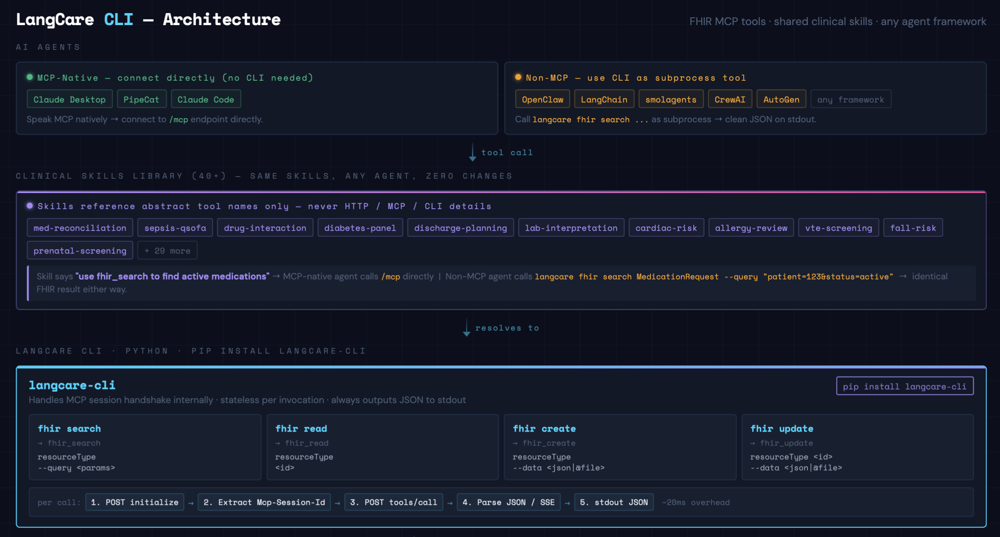

# LangCare CLI

Command-line interface for the LangCare MCP FHIR Server. Wraps 4 FHIR operations (`fhir_search`, `fhir_read`, `fhir_create`, `fhir_update`) as CLI subcommands over HTTP, handling the MCP session handshake internally.

Built for AI agents that don't speak MCP natively — LangChain, smolagents, CrewAI, AutoGen, and any framework that can call a subprocess. Agents that already speak MCP (Claude Desktop, PipeCat) connect to the server directly and don't need this CLI.

## Architecture

<p align="center">
  
</p>

The CLI handles the MCP protocol internally — agents never see JSON-RPC, session IDs, or SSE. They get clean JSON on stdout.

## Installation

### Option 1: pip install from GitHub

```bash
pip install "langcare-cli @ git+https://github.com/langcare/langcare-mcp-fhir.git#subdirectory=cli"

# Or with pipx (recommended — isolated environment)
pipx install "langcare-cli @ git+https://github.com/langcare/langcare-mcp-fhir.git#subdirectory=cli"
```

### Option 2: Install from source

```bash
cd cli/
python -m venv .venv
source .venv/bin/activate
pip install -e .
```

### Verify

```bash
langcare --version
langcare fhir --help
```

## Configuration

Two environment variables, both optional defaults:

| Variable | Default | Description |
|----------|---------|-------------|
| `LANGCARE_SERVER` | `http://localhost:8080` | MCP server URL |
| `LANGCARE_API_KEY` | (required) | Bearer token for MCP auth |

### Local server (default)

```bash
export LANGCARE_API_KEY=dev-token
# LANGCARE_SERVER defaults to http://localhost:8080
langcare fhir search Patient --query "name=John"
```

### Remote server (Fly.io)

```bash
export LANGCARE_SERVER=https://langcare-mcp-dev.fly.dev
export LANGCARE_API_KEY=tok_xxx
langcare fhir search Patient --query "name=John"
```

### Override via flags

```bash
langcare --server http://localhost:9090 --token dev-token fhir search Patient --query "name=John"
```

## Starting the MCP Server Locally

If you're not using the remote LangCare server on Fly.io, you need to run the MCP server locally **in HTTP mode**. The CLI communicates over HTTP — it cannot talk to a server running in stdio mode.

### Prerequisites

- Go 1.25+ installed
- The `langcare-mcp-fhir` repo cloned

### Start the server

```bash
cd langcare-mcp-fhir/

# Option A: Using make
make run-http

# Option B: Direct binary
make build
./bin/langcare-mcp-fhir -http -port 8080 -config configs/config.example.yaml
```

This starts the MCP server on `http://localhost:8080/mcp` connected to the HAPI FHIR public test server by default. No EMR credentials needed for testing.

### Verify the server is running

```bash
curl http://localhost:8080/health
```

Then use the CLI:

```bash
export LANGCARE_API_KEY=dev-token
langcare fhir search Patient --query "name=John"
```

## Commands

```
langcare                                  # root
langcare fhir                             # fhir subgroup
langcare fhir search <ResourceType>       # search
langcare fhir read <ResourceType> <id>    # read
langcare fhir create <ResourceType>       # create
langcare fhir update <ResourceType> <id>  # update
```

### fhir search

```bash
langcare fhir search Patient --query "name=John&birthdate=gt1990-01-01"
langcare fhir search Observation --query "patient=123&category=laboratory&_sort=-date&_count=10"
langcare fhir search MedicationRequest --query "patient=123&status=active"
langcare fhir search AllergyIntolerance --query "patient=123"
langcare fhir search Condition --query "patient=123&clinical-status=active"
```

### fhir read

```bash
langcare fhir read Patient 123
langcare fhir read Observation abc-456
```

### fhir create

```bash
langcare fhir create Observation --data '{"resourceType":"Observation","status":"final",...}'
langcare fhir create Patient --data @patient.json
```

### fhir update

```bash
langcare fhir update Patient 123 --data '{"resourceType":"Patient","id":"123",...}'
langcare fhir update MedicationRequest abc --data @med.json
```

The `--data` flag accepts a JSON string or `@filename` to read from a file.

## Output

**stdout** = result (always valid JSON — agent parses this)
**stderr** = error messages (agent ignores or logs)

### Success

```json
{"resourceType": "Bundle", "type": "searchset", "total": 3, "entry": [...]}
```

### Error

```json
{"error": "auth_error", "code": 401, "message": "Invalid bearer token"}
{"error": "network_error", "code": 0, "message": "Connection refused to localhost:8080 — is the LangCare MCP server running?"}
{"error": "fhir_error", "code": 404, "message": "Patient/123 not found"}
```

### Exit Codes

| Code | Meaning | When |
|------|---------|------|
| `0` | Success | FHIR data returned in stdout |
| `1` | FHIR / MCP error | Resource not found, invalid query, etc. |
| `2` | Auth error | Missing or invalid `LANGCARE_API_KEY` |
| `3` | Network error | Server not running, can't reach host, timeout |
| `4` | Invalid arguments | Bad JSON in `--data`, missing required arg |

## Using with AI Agent Frameworks

The CLI bridges non-MCP agents to the LangCare MCP FHIR Server. The agent registers the CLI as a subprocess tool, maps tool names to subcommands, and gets clean JSON back.

### How It Works

1. Agent framework defines tools named `fhir_search`, `fhir_read`, `fhir_create`, `fhir_update`
2. Each tool calls the CLI as a subprocess with the right subcommand and arguments
3. CLI handles MCP handshake (initialize + tools/call) internally
4. CLI returns FHIR data as JSON on stdout
5. Agent parses stdout and uses the data

### Tool Registration Pattern

```python
import subprocess
import json
import os

def call_langcare(tool_name: str, arguments: dict) -> dict:
    """Call LangCare CLI as subprocess — handles MCP plumbing internally."""

    if tool_name == "fhir_search":
        cmd = ["langcare", "fhir", "search", arguments["resourceType"],
               "--query", arguments.get("queryParams", "")]

    elif tool_name == "fhir_read":
        cmd = ["langcare", "fhir", "read",
               arguments["resourceType"], arguments["id"]]

    elif tool_name == "fhir_create":
        cmd = ["langcare", "fhir", "create", arguments["resourceType"],
               "--data", json.dumps(arguments["resource"])]

    elif tool_name == "fhir_update":
        cmd = ["langcare", "fhir", "update",
               arguments["resourceType"], arguments["id"],
               "--data", json.dumps(arguments["resource"])]

    result = subprocess.run(cmd, capture_output=True, text=True)

    # stdout is always valid JSON — success or structured error
    return json.loads(result.stdout)
    # result.returncode: 0=success, 1=error, 2=auth, 3=network, 4=args
```

Register these as tools in your agent framework:

```python
tools = {
    "fhir_search": lambda args: call_langcare("fhir_search", args),
    "fhir_read":   lambda args: call_langcare("fhir_read", args),
    "fhir_create": lambda args: call_langcare("fhir_create", args),
    "fhir_update": lambda args: call_langcare("fhir_update", args),
}
```

### How Skills Work with the CLI

The [LangCare Clinical Skills Library](../skills/README.md) contains 40+ clinical workflow guides that reference tool names like `fhir_search`, `fhir_read`, `fhir_create`, `fhir_update`. These are abstract tool names — the skills never reference HTTP, MCP, CLI, or any specific transport.

```
Skill text says:           What actually happens:
─────────────────          ─────────────────────────────────────────
"Use fhir_search to        Agent calls registered tool "fhir_search"
 find active meds"              │
                                ▼
                         call_langcare("fhir_search", {...})
                                │
                                ▼
                         langcare fhir search MedicationRequest \
                           --query "patient=123&status=active"
                                │
                                ▼
                         CLI → HTTP → MCP Server → EMR
                                │
                                ▼
                         JSON result on stdout → agent continues
```

Skills work identically whether the tools are fulfilled by:
- MCP client (Claude Desktop, PipeCat) → server directly
- CLI subprocess (LangChain, smolagents, CrewAI) → HTTP → server
- Direct HTTP calls → server

No changes to skills are needed. Copy any skill's `SKILL.md` into your agent's system prompt, register the CLI tools, and the workflows run as-is.

### Framework Examples

#### LangChain

```python
from langchain.tools import Tool

fhir_search_tool = Tool(
    name="fhir_search",
    description="Search FHIR resources. Args: resourceType (str), queryParams (str)",
    func=lambda args: call_langcare("fhir_search", json.loads(args)),
)
```

#### smolagents

```python
from smolagents import tool

@tool
def fhir_search(resourceType: str, queryParams: str = "") -> dict:
    """Search FHIR resources with query parameters."""
    return call_langcare("fhir_search", {
        "resourceType": resourceType,
        "queryParams": queryParams,
    })
```

## MCP Session Handling

The CLI is stateless — every invocation runs a fresh MCP session:

1. **Initialize** — sends `initialize` request, extracts `Mcp-Session-Id` from response header (if returned)
2. **tools/call** — sends the tool call with session ID (if available)

This adds ~20ms overhead per call (negligible vs FHIR backend latency of ~200ms). The CLI handles both `application/json` and `text/event-stream` (SSE) responses from the server.

## Project Structure

```
cli/
├── langcare/
│   ├── __init__.py          # Package version
│   ├── cli.py               # Click commands (search, read, create, update)
│   └── mcp_client.py        # MCP HTTP client (initialize + tools/call)
├── pyproject.toml           # Package config, dependencies, entry point
├── .python-version          # 3.11
└── README.md                # This file
```
