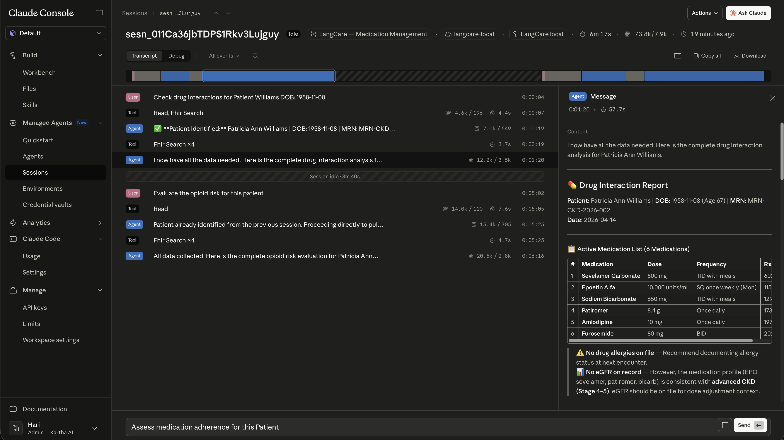
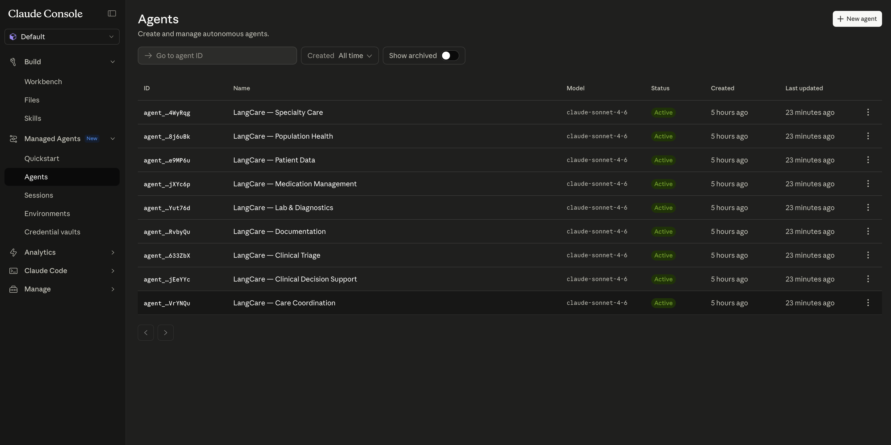

# LangCare — Claude Managed Agents (CMA)

Clinical AI agents built on the Anthropic Managed Agents API. Each agent connects to a LangCare MCP FHIR server and uses domain-specific clinical skills drawn from the [40+ Clinical Skills Library](../skills/README.md) — covering medication management, lab interpretation, clinical decision support, documentation, population health, and more.

<table align="center"><tr>
  <td></td>
  <td></td>
</tr></table>

---

## Quickstart

### 1. Install dependencies

```bash
brew install jq
pip install pyyaml
```

### 2. Set environment variables

```bash
export ANTHROPIC_API_KEY=sk-ant-...          # Required — your Anthropic API key
export LANGCARE_MCP_URL=https://langcare-mcp-dev.fly.dev/mcp   # Required — MCP server URL
export LANGCARE_MCP_TOKEN=your-bearer-token  # Optional — defaults to 'changeme'
```

### 3. Run setup

```bash
cd cma/scripts
./setup.sh dev
```

This uploads all 40 skills, creates the execution environment and vault, and deploys all 9 agents. At the end it prints:

```
  Environment ID : env_01...
  Vault ID       : vlt_01...
```

Save those — you need them to run sessions. They are also written to `.setup-state-dev.json` and reused on subsequent runs.

### 4. Get agent IDs

```bash
./list-agents.sh
```

```
agent_011Ca2j6NBnD1Qsw9vjXYc6p   LangCare — Medication Management    v3
agent_011Ca2UzNpviA8k2frbTDmba   LangCare — Care Coordination        v3
...
```

### 5. Run a session

**Single prompt:**
```bash
./run-session.sh <agent-id> <env-id> <vault-id> "your question"

# Example
./run-session.sh \
  agent_011Ca2j6NBnD1Qsw9vjXYc6p \
  env_01... \
  vlt_01... \
  "Show active medications for patient ID d886a934-5568-42b3-9324-0f0b05fc018c"
  "Show active medications for patient Williams DOB: 1958-11-08"

./run-session.sh \
  agent_011Ca2j6NBnD1Qsw9vjXYc6p \
  env_01... \
  vlt_01... \
  "Show active medications for patient Williams DOB: 1958-11-08"
```

**Interactive REPL** (omit the prompt):
```bash
./run-session.sh agent_011Ca2j6NBnD1Qsw9vjXYc6p env_01... vlt_01...
```

The REPL shows the agent's name, description, and example questions on startup. Type your message and press Enter. Use `/quit` or `Ctrl+C` to exit.

Sessions are also visible with full transcripts at **[platform.claude.com → Sessions](https://platform.claude.com/workspaces/default/sessions)**.

---

## Environment variables reference

| Variable | Required | Description |
|----------|----------|-------------|
| `ANTHROPIC_API_KEY` | Yes | Anthropic API key (`sk-ant-...`) |
| `LANGCARE_MCP_URL` | Yes | Full URL to the MCP server including `/mcp` path |
| `LANGCARE_MCP_TOKEN` | No | Bearer token for the MCP server. Defaults to `changeme` if not set |

---

## Directory structure

```
cma/
  agents/                    9 agent YAML definitions
  skills/                    40 clinical skill definitions (SKILL.md per skill)
  environments/              Execution environment configs (reference only)
  vaults/                    MCP credential configs (reference only)
  scripts/                   Automation scripts (see below)
  skills-registry.json       Generated — maps skill names → API IDs (gitignored)
  .setup-state-<tier>.json   Generated — saves environment/vault IDs (gitignored)
```

---

## Tiers

| Tier | MCP URL |
|------|---------|
| `dev` | https://langcare-mcp-dev.fly.dev/mcp |
| `staging` | https://langcare-mcp-staging.fly.dev/mcp |
| `prod` | https://langcare-mcp.fly.dev/mcp |

Pass the tier as the first argument to `setup.sh`, `deploy-agents.sh`, and `update-agents.sh`.

---

## Agents

| Agent | Skills |
|-------|--------|
| Care Coordination | discharge planning, referrals, care gaps, transitions of care, follow-up tasks |
| Clinical Decision Support | sepsis qSOFA, cardiovascular risk, VTE risk, fall risk, pneumonia CURB-65 |
| Clinical Triage | clinical summary, care gaps, lab interpretation, medication reconciliation, sepsis |
| Documentation | SOAP notes, discharge summaries, progress notes, H&P, procedure notes |
| Lab & Diagnostics | critical values, diabetes panel, lab interpretation, pre-op labs, renal function |
| Medication Management | reconciliation, drug interactions, adherence, Beers criteria, opioid risk |
| Patient Data | demographics, allergy review, clinical summary, insurance coverage, problem list |
| Population Health | chronic disease registries, immunization status, preventive care, quality measures |
| Specialty Care | chronic pain, mental health, oncology, pediatric growth, prenatal |

---

## Adding a New Skill and Agent

### 1. Create the skill

Create a directory under `cma/skills/<category>/<skill-name>/` and add a `SKILL.md` file with a YAML frontmatter header followed by the clinical workflow:

```
cma/skills/my-category/my-new-skill/
└── SKILL.md
```

`SKILL.md` structure:

```markdown
---
name: langcare-my-new-skill
description: >
  One or two sentences describing what this skill does and when the agent
  should use it. This is what the agent reads to decide whether to invoke it.
---

# My New Skill

## When to Use This Skill
...

## Clinical Workflow
1. Use `fhir_search` to ...
2. Use `fhir_read` to ...

## FHIR Resources
...

## Safety
...
```

The `name` field in frontmatter must be unique across all skills and is used as the skill ID placeholder in agent YAMLs. Convention: `langcare-<kebab-case-name>`.

---

### 2. Upload the skill

```bash
cd cma/scripts
./upload-skills.sh
```

This uploads all skills and regenerates `skills-registry.json`, which maps skill names to their Anthropic API IDs. Already-uploaded skills are skipped.

To upload a single skill only:

```bash
./upload-skill.sh ../skills/my-category/my-new-skill
```

---

### 3. Create the agent YAML

Create `cma/agents/my-agent.yaml`. Copy the structure from an existing agent and update the `name`, `description`, `system`, and `skills` sections:

```yaml
name: "LangCare — My New Agent"

model:
  id: claude-sonnet-4-6
  speed: standard

description: >
  One sentence describing what this agent specializes in.

system: |
  You are a healthcare AI agent specializing in ...

  ## How You Work
  You have access to 4 FHIR tools via the LangCare MCP server:
  - fhir_search — Query patient records by type and parameters
  - fhir_read — Retrieve a specific resource by ID
  - fhir_create — Create new clinical documentation
  - fhir_update — Update existing records

  You also have clinical skills that guide you through specific workflows.
  Follow the skill instructions when they apply.

  ## Safety Rules (Always Apply)
  1. Always verify patient identity before accessing records
  2. Never fabricate clinical data — only report what FHIR returns
  3. Flag critical or abnormal values immediately
  ...

mcp_servers:
  - name: langcare
    type: url
    url: https://langcare-mcp-dev.fly.dev/mcp   # overwritten by setup.sh

tools:
  - type: agent_toolset_20260401
    default_config:
      enabled: false
    configs:
      - name: web_search
        enabled: true
      - name: web_fetch
        enabled: true
      - name: read
        enabled: true
  - type: mcp_toolset
    mcp_server_name: langcare
    default_config:
      enabled: true
      permission_policy:
        type: always_allow
    configs: []

skills:
  - type: custom
    skill_id: "langcare-my-new-skill"   # must match name in SKILL.md frontmatter
    version: latest
  - type: custom
    skill_id: "langcare-another-skill"
    version: latest

metadata:
  category: "my-category"
  owner: langcare-team
  last_reviewed: "2026-04-13"
```

The `url` under `mcp_servers` is a placeholder — `setup.sh` and `deploy-agent.sh` overwrite it with the correct tier URL at deploy time.

---

### 4. Deploy the agent

Deploy just this one agent:

```bash
./deploy-agent.sh ../agents/my-agent.yaml dev
```

Or re-run full setup to pick up both the new skill and agent in one shot:

```bash
./setup.sh dev
```

---

### 5. Verify

```bash
./list-agents.sh   # confirm the new agent appears
./list-skills.sh   # confirm the new skill appears
```

Run a session to test:

```bash
./run-session.sh <new-agent-id> <env-id> <vault-id> "test prompt"
```

---

## Scripts reference

### setup.sh
```
Usage: ./setup.sh [dev|staging|prod]
Requires: ANTHROPIC_API_KEY, LANGCARE_MCP_URL
Optional: LANGCARE_MCP_TOKEN (defaults to 'changeme')
```
Full end-to-end setup. Uploads skills, creates environment + vault with MCP credential, deploys all agents. Safe to re-run — skips already-uploaded skills and reuses existing environment/vault from `.setup-state-<tier>.json`.

---

### run-session.sh
```
Usage: ./run-session.sh <agent-id> <env-id> <vault-id> ["prompt"]
Requires: ANTHROPIC_API_KEY
```
Creates a session and sends a prompt. With a prompt argument, runs once and prints the response. Without a prompt, opens an interactive REPL. Shows the agent banner with name, description, and example questions on startup. Tool calls are shown inline. Sessions are persisted and visible on claude.ai.

---

### list-agents.sh
```
Usage: ./list-agents.sh
```
Lists all deployed agents with their IDs, names, and current versions.

---

### list-skills.sh
```
Usage: ./list-skills.sh
```
Lists all custom skills in the workspace with their IDs and display titles.

---

### upload-skills.sh
```
Usage: ./upload-skills.sh
```
Uploads all skill definitions from `cma/skills/` to the Anthropic Skills API and writes `skills-registry.json`. Pre-fetches existing skills and skips any already uploaded (idempotent). Must be run before deploying agents.

---

### upload-skill.sh
```
Usage: ./upload-skill.sh <skill-directory>
Output: name|skill_id
```
Uploads a single skill directory. Used internally by `upload-skills.sh`.

---

### deploy-agents.sh
```
Usage: ./deploy-agents.sh [dev|staging|prod]
```
Deploys all 9 agents. Creates new agents or updates existing ones by name. Called automatically by `setup.sh`.

---

### deploy-agent.sh
```
Usage: ./deploy-agent.sh <agent-yaml-file> [dev|staging|prod]
```
Creates a single new agent from a YAML file. Resolves skill name placeholders to real API IDs using `skills-registry.json`.

---

### update-agents.sh
```
Usage: ./update-agents.sh [dev|staging|prod]
```
Updates all 9 existing agents to their latest YAML definition. Use this after editing agent YAMLs.

---

### update-agent.sh
```
Usage: ./update-agent.sh <agent-id> <agent-yaml-file> [dev|staging|prod]
```
Updates a single existing agent (creates a new version via optimistic locking).

---

### delete-skills.sh
```
Usage: ./delete-skills.sh <prefix>
Example: ./delete-skills.sh langcare-
```
Deletes all skills whose display title starts with the given prefix. Deletes all versions first (required by the API), then the skill itself.

---

### cleanup.sh
```
Usage: ./cleanup.sh [--yes]
```
Deletes all LangCare agents, skills, environments, vaults, and credentials from the Anthropic workspace, then removes local state files. Without `--yes`, previews what will be deleted and asks for confirmation. Irreversible — run `setup.sh` to recreate everything.

---

### validate.sh
```
Usage: ./validate.sh
```
Validates all agent YAML files and skill SKILL.md files for required fields and correct structure.

---

## Troubleshooting

**`yaml` module not found**
```bash
pip install pyyaml
```

**Agent deploy fails with skill not found**
`skills-registry.json` is missing or stale. Run `./upload-skills.sh` to regenerate it.

**Session shows "awaiting approval"**
The MCP toolset in the agent YAML is missing `permission_policy.type: always_allow`. Check the `tools` section of the agent YAML and redeploy with `update-agents.sh`.

**Environment/vault already exists on re-run**
`setup.sh` reads `.setup-state-<tier>.json` and reuses existing IDs. If the file is missing (e.g. after `cleanup.sh`), it creates fresh resources.

**Duplicate skills in workspace**
Run `./delete-skills.sh <old-prefix>` to remove the obsolete set.

**Session exits immediately in interactive mode**
Make sure you are running `run-session.sh` directly in your terminal, not piped or redirected — the REPL needs a TTY for `input()`.
